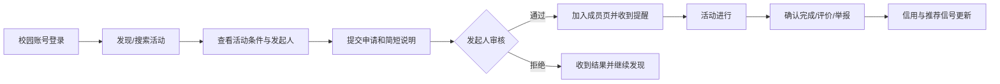

# 「搭个伴 CampusMate」校园搭子匹配平台

## 完整项目企划书（V1.0）

> **一句话定位：** 一个以校园实名与具体活动为边界，帮助学生安全、高效地找到同伴并完成组队的轻量化平台。

## 一、项目摘要

### 1.1 要解决的问题

学生寻找自习、运动、竞赛、兴趣活动同伴时，通常依赖班群、社团群、朋友圈等非结构化渠道。信息容易被覆盖，参与门槛和活动条件不透明，且陌生同学之间缺乏基本的信任与安全机制。CampusMate 将零散的“找搭子”需求转成可发布、可筛选、可申请、可审核、可反馈的活动协作流程。

### 1.2 目标与边界

| 项目目标 | 首期不做 |
| --- | --- |
| 提高校园活动组队效率 | 恋爱匹配或陌生人泛社交 |
| 建立可信、可追溯的短期组队流程 | 支付、交易和商业撮合 |
| 在一个校区内验证需求和留存 | 面向社会开放注册 |
| 用低成本 MVP 完成真实可演示闭环 | 复杂即时通信和 AI 大模型推荐 |

### 1.3 首期成果定义

以单校区试点为范围，在 8 周内交付一个响应式 Web MVP。用户可完成“校园账号登录—浏览或发布活动—申请加入—发起人审批—成员确认—活动结束评价”的闭环；管理员可处理举报和下架违规内容。

## 二、市场与用户洞察

### 2.1 用户分层

| 用户群 | 核心任务 | 使用动机 | 首期优先级 |
| --- | --- | --- | --- |
| 新生、跨校区学生 | 认识同学、熟悉校园 | 降低融入成本 | 高 |
| 自习与运动需求者 | 找到时间地点一致的伙伴 | 提升坚持度与安全感 | 高 |
| 竞赛、项目发起者 | 补齐队伍技能与人数 | 提升组队效率 | 高 |
| 社团干部、活动组织者 | 招募参与者、组织小队 | 降低通知和统计成本 | 中 |
| 校园管理者 | 了解风险活动与处理投诉 | 保障秩序 | 中 |

### 2.2 三个核心用户画像

| 画像 | 痛点 | 关键产品承诺 |
| --- | --- | --- |
| 大一新生小林：想打羽毛球，但没有固定球友 | 不认识人、担心尴尬或不安全 | 看到公开时间、技能水平、人数与认证信息，快速申请 |
| 竞赛负责人小周：缺一位 UI 设计成员 | 群里招募信息很快被淹没，无法识别技能匹配度 | 用技能标签、作品链接（后续）和截止日期筛选申请人 |
| 考研学生小陈：需要规律自习监督 | 希望稳定但不想加入沉默大群 | 发布周期性学习计划，形成小规模的固定小组 |

### 2.3 需求验证假设与调研方案

不要假设“学生需要社交”，而要验证“学生是否愿意为完成具体活动而使用一个新工具”。首期在目标校区完成 30–50 份问卷和 8–12 次访谈。

| 需要验证的假设 | 验证方法 | 成立信号 |
| --- | --- | --- |
| 学生每月至少有一次找同伴需求 | 问卷：近三个月的相关经历 | 超过 60% 的受访者回答“有” |
| 运动、自习、竞赛是高频切入场景 | 排序题与访谈 | 前三类累计被选比例超过 70% |
| 实名认证可提升申请意愿 | 原型 A/B 展示 | 认证版本的信任评分更高 |
| 发起人愿意审核而非自动入组 | 任务访谈 | 多数发起人选择“审核制” |
| 用户接受活动后评价 | 原型测试 | 超过 70% 愿意提交简单评价 |

访谈重点不问“你会不会用”，而追问最近一次找搭子的完整过程、使用渠道、放弃原因以及对陌生人组队的顾虑。

## 三、产品策略与体验设计

### 3.1 产品原则

1. **活动先于社交：** 任何连接都应由清晰的活动、时间、地点和人数触发。
2. **小范围优先：** 首期限定本校认证用户和公共校园地点，避免失控扩张。
3. **透明但最小披露：** 匹配前仅展示完成活动所需的必要资料，联系方式由用户自行决定是否交换。
4. **默认安全：** 所有活动均可举报，首次线下见面提示选择公共区域。
5. **低操作成本：** 发布一条普通活动应在 1 分钟内完成；申请应不超过 3 步。

### 3.2 MVP 用户旅程

### 3.3 功能优先级

| 优先级 | 功能 | 价值 | MVP 判断标准 |
| --- | --- | --- | --- |
| P0 | 校园登录、活动列表、筛选、详情 | 用户能发现合适活动 | 可按类别、日期、校区、关键词筛选 |
| P0 | 发布、申请、审核、退出 | 完成组队核心闭环 | 名额、状态、成员数始终一致 |
| P0 | 我的组队、通知、基础举报 | 用户可管理和获得反馈 | 申请与审核结果可查、可追溯 |
| P1 | 收藏、活动提醒、评价 | 提升回访和信任 | 活动前后出现适当提醒 |
| P1 | 规则推荐、周期性活动 | 增加匹配效率与留存 | 推荐理由可解释 |
| P2 | 群聊、地图、AI 发布助手 | 改善体验 | 先以外部群链接或通知替代 |

### 3.4 关键业务规则

| 规则 | 设计 |
| --- | --- |
| 名额 | 仅审批通过后占用名额；达到上限时自动关闭申请入口 |
| 申请 | 同一用户对同一活动仅允许一条有效申请；可在处理前撤回 |
| 发起人 | 可编辑活动，但时间、地点、人数变更需通知已通过成员 |
| 取消 | 发起人取消活动需填写原因；距离开始 24 小时内取消会影响信用记录 |
| 退出 | 成员可退出；开始前 24 小时内退出应提醒发起人，并记录为轻微负向信号 |
| 结束 | 到达结束时间后进入“待确认”；成员可确认完成、评价、举报 |
| 公开性 | 活动默认仅对本校认证用户可见；不公开手机号、精确宿舍和证件信息 |

### 3.5 推荐逻辑（可解释、可迭代）

首期不使用黑箱模型。对用户 $u$ 与活动 $a$ 计算规则分：

`score(u,a) = 兴趣匹配×0.40 + 时间适配×0.25 + 地点适配×0.20 + 行为相似×0.15`

推荐卡片必须显示原因，例如“与你关注的羽毛球相符”“距你常用校区较近”“活动尚有 2 个名额”。冷启动时优先展示同校区、近期、名额充足、信用正常的热门活动。

## 四、运营与增长方案

### 4.1 冷启动策略：先做“活动供给”，再做流量

校园匹配平台的初期问题不是算法，而是活动不足。首期选择 **1 个校区 + 3 个高频类别（运动、自习、竞赛）**，以种子发起人提供稳定供给。

| 阶段 | 核心动作 | 目标 |
| --- | --- | --- |
| 内测（第 1–2 周） | 招募 20 名种子用户；手工准备 30 条真实感活动 | 验证流程和内容规范 |
| 试点（第 3–5 周） | 联动羽毛球社、学习互助社群、竞赛社团；设置“本周搭子”活动页 | 每周新增 20 条有效活动 |
| 扩散（第 6–8 周） | 邀请码、活动海报、社群管理员共创、完成活动徽章 | 验证自然邀请与复访 |

### 4.2 校园推广方式

1. 在图书馆、体育馆、食堂等真实场景放置二维码海报，直接跳转到相应活动分类。
2. 与社团合作：社团获得招募工具和活动专区，平台获得稳定活动供给。
3. 设计“新生破冰周”“期末自习互助周”“周末运动局”等主题运营活动。
4. 邀请成功并完成首场活动后给予非现金激励，如主题徽章、优先曝光次数或校园周边抽奖资格。
5. 通过班委、学生会或社群管理员建立内容共建机制，但不把个人联系方式导出或用于营销。

### 4.3 内容治理与供给标准

活动应包含明确的活动内容、时间、公共地点、人数和参与要求。禁止发布性骚扰、歧视、诈骗、赌博、违法交易、校外高风险邀约和泄露他人信息的内容。对空泛标题、长期无明确时间地点的“纯交友帖”进行限流或引导补全。

## 五、商业模式与资源测算

### 5.1 价值主张

| 对象 | 获得的价值 |
| --- | --- |
| 学生 | 更快找到时间匹配、身份可验证的活动伙伴 |
| 社团/组织者 | 更结构化的招募、报名和成员管理能力 |
| 学校/学生工作部门 | 更安全、有规则、可处理投诉的活动连接渠道 |

### 5.2 商业化原则

课程和试点阶段以验证使用价值为主，**不向学生收费，也不接入支付**。产品验证后再探索以下合规、低干扰的收入路径：

| 路径 | 适用时点 | 说明 |
| --- | --- | --- |
| 校园社团工具包 | 形成稳定社团使用后 | 提供报名统计、活动页装修、消息触达等组织功能 |
| 校园官方合作 | 获得学校授权后 | 为迎新、志愿服务、体育活动提供定制专区 |
| 合规场地/活动合作 | 有清晰审核机制后 | 仅展示与学生活动直接相关的场地或赛事信息，明确广告标识 |

### 5.3 试点预算（估算）

| 项目 | 估算金额 | 说明 |
| --- | ---: | --- |
| 域名与基础托管 | 0–300 元/年 | 开发阶段可使用免费额度 |
| 数据库与认证 | 0–500 元/年 | 初期使用免费或低配方案 |
| 视觉与推广物料 | 300–1,000 元 | 海报、二维码、活动奖品 |
| 用户调研激励 | 300–800 元 | 访谈小礼品或校园饮品券 |
| 预留费用 | 500 元 | 不可预见支出 |
| **合计** | **1,100–3,100 元** | 不含团队人力成本 |

以上为课堂/校园试点粗略估算，正式运营需要根据学校信息化、安全审核与用户规模重新评估。

## 六、技术、数据与安全方案

### 6.1 技术演进

| 阶段 | 架构 | 目标 |
| --- | --- | --- |
| 原型 | Next.js + TypeScript + Tailwind + Mock/localStorage | 验证界面和核心流程 |
| 内测 | Next.js + Supabase Auth/PostgreSQL | 验证真实多用户状态与权限 |
| 试点 | 增加 RLS、日志、监控、内容审核队列 | 保障可信和可运营 |

### 6.2 建议补充的数据实体

除 `profiles`、`activities`、`applications`、`activity_members`、`messages` 外，建议增加：

| 表 | 关键字段 | 用途 |
| --- | --- | --- |
| `reports` | reporter_id、target_type、target_id、reason、status | 举报受理、审查与留痕 |
| `reviews` | activity_id、reviewer_id、reviewee_id、rating、tags | 完成后的结构化评价 |
| `notifications` | user_id、type、payload、read_at | 统一管理业务提醒 |
| `blocks` | blocker_id、blocked_id、created_at | 防止不希望的再次接触 |
| `audit_logs` | actor_id、action、resource_id、created_at | 关键管理和状态变更追溯 |

### 6.3 权限与隐私底线

1. 认证用户只能修改自己的资料、自己创建的活动和自己的申请。
2. 只有活动发起人可审批该活动的申请；平台管理员仅在治理职责内访问举报相关信息。
3. 数据库使用 Row Level Security，前端不保存服务端密钥。
4. 仅收集完成匹配所需的最少信息；联系方式不作为必填项。
5. 清晰说明数据用途、保存期限、注销入口及投诉渠道；正式上线前应通过学校相关审核。
6. 对未成年人、敏感个人信息、跨校开放、商业推广等情形，必须重新做合规评估。

## 七、数据指标与验收体系

### 7.1 北极星指标

**每周成功确认的有效组队数**：至少一名成员被审批通过，并在活动结束后有一方确认活动完成的活动数量。这个指标同时反映供给、匹配和真实履约，而不是只统计浏览量。

### 7.2 指标漏斗

| 环节 | 指标 | 试点目标（8 周） |
| --- | --- | ---: |
| 获取 | 注册认证用户数 | 150 |
| 激活 | 首次浏览后 7 天内发布或申请用户占比 | ≥ 35% |
| 匹配 | 有效申请被通过率 | ≥ 40% |
| 履约 | 被通过活动的完成确认率 | ≥ 60% |
| 留存 | 第 2 周仍有浏览、发布或申请行为的用户占比 | ≥ 25% |
| 体验 | 活动完成后满意度（5 分制） | ≥ 4.0 |
| 安全 | 24 小时内处理的有效举报比例 | ≥ 90% |

### 7.3 复盘机制

每周固定查看：活动新增量、各类别供需差、申请通过率、活动取消率、举报量和用户反馈。若某类活动持续“申请多、供给少”，优先招募对应类别发起人；若取消率偏高，检查活动时间、地点和人数设置是否过于模糊。

## 八、项目组织与协作

| 角色 | 主要职责 | 阶段产出 |
| --- | --- | --- |
| 产品负责人 | 用户调研、需求排序、验收标准、复盘 | PRD、用户旅程、迭代清单 |
| 前端开发 | 页面、交互、状态管理、响应式适配 | 可演示的 MVP |
| 后端/数据负责人 | 数据模型、认证、RLS、接口与日志 | Supabase 方案和权限测试 |
| UI/UX 负责人 | 设计系统、原型、可用性测试 | 高保真界面与组件规范 |
| 运营与治理负责人 | 种子用户、活动规则、举报流程、反馈 | 试点活动与运营周报 |

小组人数较少时，可由一人兼任多个角色，但每项职责必须有唯一负责人。使用 GitHub 看板管理需求，按“待验证—待开发—开发中—待测试—已完成”流转；每周一次演示和复盘。

## 九、8 周实施里程碑

| 周次 | 工作重点 | 可验证交付物 |
| --- | --- | --- |
| 第 1 周 | 用户调研、竞品扫描、范围冻结 | 访谈纪要、MVP 清单、流程图 |
| 第 2 周 | 信息架构、视觉规范、数据模型 | 可点击原型、类型定义、模拟数据 |
| 第 3 周 | 发现页、筛选、详情页 | 可浏览活动目录 |
| 第 4 周 | 发布、申请、审批、我的组队 | 本地完整业务闭环 |
| 第 5 周 | 异常状态、响应式、可用性测试 | 10 名用户走查报告与问题清单 |
| 第 6 周 | Supabase 认证、数据库、RLS | 多用户内测版本 |
| 第 7 周 | 种子用户试点、内容运营、数据看板 | 运营周报与迭代清单 |
| 第 8 周 | 安全检查、演示脚本、部署与答辩 | 线上演示地址、完整汇报材料 |

## 十、风险管理与应急预案

| 风险 | 预警信号 | 预防 | 应急处理 |
| --- | --- | --- | --- |
| 活动供给不足 | 列表空、申请无法匹配 | 先运营种子发起人与高频类别 | 手工组织主题活动，缩小试点范围 |
| 安全事件或骚扰举报 | 重复举报、异常私信 | 校园认证、公共地点提示、拉黑举报 | 先限制相关账号/内容，留存证据并按规则处理 |
| 虚假活动或爽约 | 取消率、低评分升高 | 明确规则、信用记录、活动提醒 | 下架活动，限制重复违规账号 |
| 开发延期 | P0 功能未闭环 | 按 P0/P1/P2 严格裁剪 | 停止 P1/P2，确保本地 MVP 可演示 |
| 数据越权 | 非本人可读写记录 | RLS 测试、最小权限、环境变量管理 | 立即收紧策略、排查日志、通知受影响用户 |
| 用户冷启动流失 | 激活/次周留存偏低 | 首日引导和高质量活动供给 | 优化引导，访谈流失用户，调整场景 |

## 十一、答辩展示叙事

建议采用“问题—方案—验证—成果—未来”的结构，而不是逐页讲功能。

1. **问题：** 以“周五想找羽毛球搭子”为例，说明群聊信息分散、条件不清与信任不足。
2. **方案：** 展示 CampusMate 将活动信息结构化，并通过申请审核建立可控组队。
3. **现场演示：** 发现筛选 → 查看详情 → 提交申请 → 发起人审批 → 成员与人数同步变化。
4. **可信性：** 展示校园认证、隐藏联系方式、举报拉黑与信用规则。
5. **开发价值：** 说明 Vibe Coding 如何按数据模型、组件、交互和测试逐步辅助开发，而非一次性生成系统。
6. **验证与迭代：** 汇报试点指标、用户反馈和下一阶段 Supabase 多用户升级计划。

## 十二、下一步行动清单

- [ ] 用 3 天完成至少 30 份问卷与 8 次深访，确认首批高频分类。
- [ ] 冻结 P0 功能，建立页面清单和字段字典。
- [ ] 准备不少于 30 条覆盖三类场景的高质量模拟活动。
- [ ] 实现并测试“发布—申请—审批—成员数更新—退出/取消”的状态机。
- [ ] 邀请 10 名目标用户完成可用性走查，记录任务成功率与问题。
- [ ] 在内测数据通过验收后，再接入真实登录与 Supabase 权限策略。

---

### 结论

CampusMate 的核心不是把“找搭子”做成泛社交，而是通过校园认证、明确活动条件、可控审批和完成反馈，让学生以更低的不确定性完成一件原本想做的事。首期成功标准不是功能数量，而是能否在一个明确校区内稳定促成一批安全、真实、可复盘的组队。
